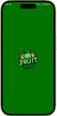
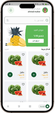

# FruitHub 🍎🍌🍊

**FruitHub** is a modern Flutter application designed for seamless fruit shopping, offering secure authentication, intuitive product browsing, and an exceptional user experience. Built with clean architecture and industry-standard best practices.

---

## ✨ Features

### 🔐 Authentication

- **Email/Password** - Secure registration and login 📧
- **Social Sign-In** - Google and Facebook authentication 🌐
- **Session Management** - Persistent user sessions 🔄
- **Form Validation** - Real-time input validation ✅
- **Error Handling** - User-friendly error messages ⚠️

---

### 🛍️ Core Features

- 🍎 Browse fresh fruits with detailed product views
- 🛒 Robust shopping cart functionality
- 📱 Responsive UI optimized for all devices
- 🌍 Multi-language support for global accessibility
- 🔄 Efficient state management with BLoC
- 🔥 Firebase-powered backend for scalability

---

## 📸 Screenshots

| Splash Screen | Login Screen| Sign-Up Screen | Home Screen |
|---------------|-------------|----------------|---------------|
|  |  |  |  |

---

## 🛠️ Tech Stack

- **Framework**: Flutter 📱
- **State Management**: `flutter_bloc` 🧩
- **Backend**: Firebase (Auth, Firestore) 🔥
- **Local Storage**: `SharedPreferences` 💾
- **Dependency Injection**: `get_it` 🛠️
- **Internationalization**: `intl` 🌐
- **UI Components**: Custom widgets with Material Design 3 🎨

---

## 📋 Prerequisites

- Flutter SDK (>=3.0.0) 🦋
- Dart SDK (>=2.19.0 <4.0.0) 🎯
- Android Studio / Xcode 🖥️
- Firebase account 🔥
- Google Cloud account ☁️
- Facebook Developer account (for Facebook Login) 📱

---

## 🏗️ Project Structure

```
textlib/
├── core/                     # Core functionality
│   ├── errors/              # Error handling ⚠️
│   ├── services/            # External services 🌐
│   ├── theme/               # App theming 🎨
│   └── utils/               # Utilities 🛠️
├── features/                # Feature modules
│   ├── auth/                # Authentication 🔐
│   │   ├── data/            # Data layer 📊
│   │   ├── domain/          # Business logic 🧠
│   │   └── presentation/    # UI layer 🖼️
│   ├── home/                # Home feature 🏠
│   ├── products/            # Products feature 🍎
│   └── profile/             # User profile 👤
└── main.dart                # App entry point 🚀
```

---

## 🔄 Authentication Flow

### 📝 User Registration

- Email/Password sign-up
- Social account linking (Google, Facebook)
- Optional email verification
- User profile creation

### 🔑 User Login

- Email/Password authentication
- Social authentication (Google, Facebook)
- Session restoration
- Comprehensive error handling

---

## 🔒 Security

- Secure credential storage
- Token management
- Rate limiting protection
- Input sanitization

---

## 🚀 Getting Started

### 1. Clone the Repository

```bash
git clone https://github.com/your-username/fruit_hub.git
cd fruit_hub
```

### 2. Install Dependencies

```bash
flutter pub get
```

### 3. Firebase Setup

- Create a new Firebase project 🔥
- Add Android/iOS apps to your project
- Download configuration files:
    - `google-services.json` (Android)
    - `GoogleService-Info.plist` (iOS)
- Place them in the respective platform folders

### 4. Configure Authentication

- Enable authentication methods in Firebase Console:
    - Email/Password
    - Google Sign-In
    - Facebook Login
- Add Facebook App ID and Client Token to Firebase

### 5. Run the App

```bash
flutter run
```

---

## 🏭 Building for Production

### Android

```bash
flutter build apk --release
# or
flutter build appbundle
```

### iOS

```bash
flutter build ios --release
# Then open Xcode and archive the app
```

---

## 📦 Dependencies

- **State Management**: `flutter_bloc`, `equatable` 🧩
- **Navigation**: `go_router` 🗺️
- **Firebase**: `firebase_core`, `firebase_auth`, `cloud_firestore` 🔥
- **UI**: `google_fonts`, `flutter_svg`, `modal_progress_hud_nsn` 🎨
- **Localization**: `intl`, `intl_utils` 🌐
- **Social Auth**: `google_sign_in`, `flutter_facebook_auth` 📱

---

## 🤝 Contributing

1. Fork the repository 🍴
2. Create your feature branch
```bash
git checkout -b feature/AmazingFeature
```
3. Commit your changes
```bash
git commit -m 'Add some AmazingFeature'
```
4. Push to the branch
```bash
git push origin feature/AmazingFeature
```
5. Open a Pull Request 📬

---

## 📄 License

This project is licensed under the **MIT License** - see the LICENSE file for details.

---

## 💬 Support

For support, please open an issue in the GitHub repository 📢.

